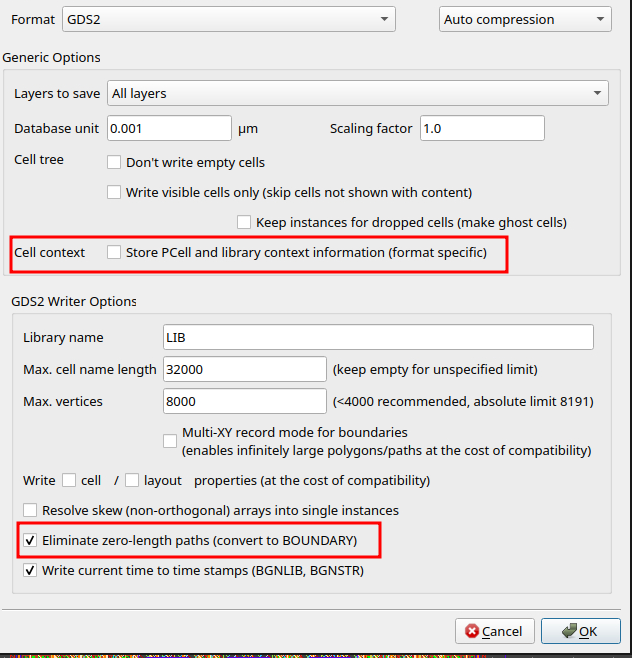

# IP Repository Structure

## Key assumptions

The organization of this repository and its tooling is guided by the following
assumptions, which define both scope and integration boundaries:

1) The primary focus of this repository is the IP data itself rather than the hosting of
   implementation flows.
2) IP data is intentionally decoupled from flows. Flows are expected to be delivered as
   separate repositories and to source and export IP data using the proposed format.
3) Dependencies are handled recursively and may be implemented as submodules to preserve
   traceability and ensure reproducible integration.

## IP development and contribution workflow

This repository is not intended for active IP development. Instead, use the generator
script to create a standalone IP repository, publish it on GitHub, and then request
inclusion as a submodule in the corresponding Open-Silicon-MPW repository. The goal is
to keep this repository as a curated aggregation of production-ready IPs and shared
automation assets.

Four directory structures are available, corresponding to Analog, Digital, RF, and
Mixed-Signal design categories.


Keep `doc/info.json` accurate throughout development. This metadata is used for IP
evaluation, maintenance, and provisioning, and it enables automated checks. Many of
these checks are expected to be handled by GitHub Actions (data consistency, DRC, LVS,
and linting), so completeness and correctness are mandatory.

## Categories

Categories and subcategories are standardized. Select the correct subcategory before
generation and keep the category consistent with the repository placement under
`March-2026/<Category>`. Subcategories map to fixed abbreviations and those abbreviations
must be used in the top-level IP name and kept consistent with `doc/info.json`.

| Category | Subcategory | Abbreviation |
| --- | --- | --- |
| Analog | Bandgap Reference | BGR |
| Analog | Comparator | CMP |
| Analog | Operational Amplifier | OPA |
| Analog | Low Dropout Regulator | LDO |
| Analog | Voltage Reference | VREF |
| Analog | Charge Pump | CP |
| Analog | Temperature Sensor | TSENSE |
| Analog | Oscillator | OSC |
| Analog | Power Management IC | PMIC |
| Digital | Microcontroller | MCU |
| Digital | Microprocessor | MPU |
| Digital | RISC-V Core | RISCV |
| Digital | Memory Controller | MEMCTRL |
| Digital | DMA Controller | DMA |
| Digital | Security Engine | SEC |
| Digital | Cryptographic Accelerator | CRYPTO |
| Digital | Interconnect/Fabric | NOC |
| Digital | GPIO | GPIO |
| Digital | Timer/Counter | TIMER |
| Digital | UART | UART |
| Digital | SPI | SPI |
| Digital | I2C | I2C |
| Mixed-Signal | Analog to Digital Converter | ADC |
| Mixed-Signal | Digital to Analog Converter | DAC |
| Mixed-Signal | Phase-Locked Loop | PLL |
| Mixed-Signal | Sigma-Delta Modulator | SDM |
| Mixed-Signal | Clock and Data Recovery | CDR |
| Mixed-Signal | SerDes | SERDES |
| Mixed-Signal | Mixed-Signal PHY | MSPHY |
| RF | Low Noise Amplifier | LNA |
| RF | Power Amplifier | PA |
| RF | Mixer | MIX |
| RF | Voltage-Controlled Oscillator | VCO |
| RF | RF PLL | RFPLL |
| RF | Frequency Synthesizer | FSYN |
| RF | RF Front End | RFFE |
| RF | RF Switch | RFSW |
| RF | Balun | BALUN |

## Submission process

1) Select category and subcategory.
2) Clone the Open-Silicon-MPW repository to obtain `gen_structure.py`.
3) Run the generator outside this repository to create the IP repo skeleton:

```
python3 gen_structure.py <technology> <subcategory> [dependency1 dependency2 ...]
```

**Note:** `technology` must be `IHP`.

**Tip:** Dependencies can be submodules, provided they follow the same IP structure
conventions as the top-level repository.

4) Develop and document the IP in the standalone repository:
   - Keep the directory layout intact.
   - Keep the top cell name aligned with the generated name across all views.
   - Maintain `doc/info.json` with accurate metadata, release paths, and dependencies.
   - Fill the corresponding TRL document under `doc/`.
   - Populate `release/<version>/` with production-ready deliverables (GDS, netlist,
     and supporting documentation).
5) Publish the IP repository on GitHub.
6) Sync shared workflows (optional but recommended). If the generated IP repo includes
   `check-workflow-sync.yml`, it stages workflow updates into `.github/workflows-staged/`
   and opens an issue describing what was staged.

**Tip:** To activate a staged workflow, copy it manually into `.github/workflows/`.

7) Request submodule inclusion by opening a GitHub issue with this snippet:

```
## Submodule request

- Repository URL: https://github.com/<org>/<repo>.git
- Category directory: March-2026/<Category> (Analog, Digital, RF, Mixed-Signal)
- Submodule path: March-2026/<Category>/IHP__<subcategory-abbrev>-<4digits>

### .gitmodules snippet

[submodule "March-2026/<Category>/IHP__<subcategory-abbrev>-<4digits>"]
  path = March-2026/<Category>/IHP__<subcategory-abbrev>-<4digits>
  url = https://github.com/<org>/<repo>.git
```

## Physical verification

Physical verification is automated and reproducible. The flow performs DRC and LVS
using the official IHP SG13G2 KLayout decks. It resolves `release.gds` and
`release.netlist` from `doc/info.json` before tool installation. If neither is
referenced, the flow exits early with a warning and skips both stages. If a
reference is present but the file is missing, the run fails immediately. When a
layout is present without a netlist, DRC runs and LVS is skipped with a warning;
LVS requires both artifacts.

**Warning:** If `release.gds` or `release.netlist` is referenced in `doc/info.json`
but the file is missing, the verification run fails immediately.

The flow installs minimal system prerequisites (`jq`, `python3-pip`), selects a
KLayout package matching the runner's Ubuntu version, and validates the package
before installation. Python dependencies are installed from the IHP Open PDK
requirements. The official DRC and LVS rule decks are fetched via a sparse
checkout to keep the download lightweight and deterministic.

DRC runs with pre-checks enabled, writing results to a temporary directory. LVS
runs only when both layout and netlist are present, writing results to a
separate temporary directory. Both result directories are uploaded as
artifacts even when a stage fails.

**Tip:** Keep release artifacts and their paths in `doc/info.json` aligned before
triggering verification to avoid avoidable re-runs.

## Acceptance criteria

- The repository matches the generated structure and naming convention.
- `doc/info.json` is complete and correct.
- Release data is present under `release/<version>/` with paths referenced in
  `doc/info.json`.
- Dependencies are present under `dependencies/` and follow the same structure
  (submodules are acceptable).

**Note:** A submission-ready GDS must satisfy the complete sign-off checklist:

1. A seal ring must be present.
2. Filler cells must be generated and included.
3. The layout must be DRC clean, including the minimal rules in
   https://github.com/IHP-GmbH/IHP-Open-PDK/blob/main/ihp-sg13g2/libs.tech/klayout/tech/drc/docs/precheck_rules.md.
4. The layout must be LVS clean against the final netlist.
5. The final release under `release/<version>/` must be saved using the KLayout
   options shown in the figure below.



### IP preparation checklist

- [ ] Category and subcategory selected; abbreviation matches naming.
- [ ] Repository follows the generated structure and naming convention.
- [ ] Top cell name matches the generated name across all views.
- [ ] `doc/info.json` is complete and current.
- [ ] TRL document is present under `doc/`.
- [ ] Dependencies are listed under `dependencies/` and follow the structure.
- [ ] `release/<version>/` contains final GDS and netlist.
- [ ] Release paths in `doc/info.json` resolve to existing files.
- [ ] Seal ring present.
- [ ] Fillers generated and included.
- [ ] DRC clean (including minimal precheck rules).
- [ ] LVS clean against the final netlist.
- [ ] Final GDS saved with the documented KLayout options.

## Guidelines for Flow Developers

Flow automation should preserve the systematic repository structure created by the
generator and used across IPs. The `doc/info.json` file is required metadata and should
be filled out automatically by the flow. This automation is work in progress, so treat
missing fields as a blocking issue and plan for incremental updates as the flow evolves.
